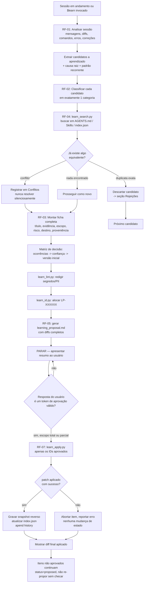

# Arquitetura do `$learn`

## Visão geral

`$learn` é um sistema de gestão de conhecimento para o agente, não um atalho para editar
`AGENTS.md`. Três camadas:

1. **Pacote da skill** (este diretório, versionado no catálogo de skills) — instruções,
   scripts determinísticos, templates. Estático, igual em todo projeto que a instala.
2. **Estado runtime** (`.agents/learn/` no projeto-alvo) — os aprendizados de fato, o índice,
   propostas pendentes, histórico. Dinâmico, específico de cada projeto.
3. **Destinos de promoção** (`AGENTS.md` em algum escopo, `.agents/skills/<nome>/`, docs do
   projeto) — onde o conhecimento aprovado efetivamente passa a valer.

A separação entre (2) e (3) é o que torna o rollback possível sem restaurar arquivos inteiros: o
learning em si (com seu diff e proveniência) é um objeto de primeira classe em (2); (3) é apenas o
efeito, sempre derivável e revertível a partir de (2).

## Diretório runtime

```
.agents/learn/
├── index.json                    # índice leve; ver assets/templates/index-schema.json
├── .counter                      # contador atômico (fcntl) para IDs LP-XXXXXX
├── learnings/
│   └── LP-000123.md              # ficha completa; ver assets/templates/learning-entry.md
├── proposals/
│   └── <YYYY-MM-DD>-<slug>/
│       └── learning_proposal.md  # ver assets/templates/learning_proposal.md
├── history/
│   └── <YYYY-MM-DD>.jsonl        # log append-only; ver assets/templates/history-entry.schema.json
└── snapshots/
    └── LP-000123.pre.diff        # diff reverso capturado no apply; usado só pelo rollback
```

`index.json` é a fonte rápida para busca/auditoria (scripts nunca precisam abrir todos os
`.md`); `learnings/<id>.md` é a fonte completa e auditável (o índice pode, em princípio, ser
reconstruído a partir dos arquivos `.md`, já que seu frontmatter é um superset do registro no
índice).

## Fluxograma completo



## Categorias

| Categoria | Definição | Destino padrão de promoção |
|---|---|---|
| `Rule` | Comportamento permanente do agente | Seção "Regras" do `AGENTS.md` no escopo detectado |
| `Skill` | Fluxo operacional reutilizável | Nova/atualizada `SKILL.md` em `.agents/skills/<nome>/` |
| `Pattern` | Arquitetura recorrente observada no código | Seção "Padrões" do `AGENTS.md` ou doc de arquitetura do projeto |
| `Documentation` | Conhecimento informativo sobre o projeto | Doc do projeto (ex.: `docs/`) ou seção "Contexto" do `AGENTS.md` |
| `AntiPattern` | Comportamento proibido / erro recorrente | Seção "Nunca fazer" do `AGENTS.md` |
| `Decision` | Decisão arquitetural | `docs/adr/` se existir, senão seção "Decisões" do `AGENTS.md` |
| `Convention` | Convenção do projeto (estilo, nomenclatura) | Seção "Convenções" do `AGENTS.md` |
| `Checklist` | Sequência operacional | `assets/templates/` do projeto ou seção "Checklists" do `AGENTS.md` |
| `Template` | Modelo reutilizável | `assets/templates/<nome>.md` do projeto |
| `Reference` | Ponteiro para material de consulta externo | Seção "Referências" do `AGENTS.md` (só o ponteiro, nunca o conteúdo duplicado) |
| `Ignore` | Conhecimento temporário / decisão de não agir | Só existe em `learnings/`, `status: ignored`, nunca promovido |

`Ignore` é o mecanismo de **aprendizado negativo silencioso**: quando o usuário decide
explicitamente não generalizar algo, gravar como `Ignore` impede que a mesma sugestão volte a
aparecer em toda sessão futura (ver RF-04 — buscar inclui itens `ignored`).

## Proveniência

Cada `learnings/<id>.md` registra, na seção "Proveniência" do corpo (não no frontmatter, que fica
enxuto para as ferramentas): sessão de origem, mensagens relevantes, arquivos lidos/alterados,
commits, testes, e diffs de código observados (distintos do "Diff proposto", que é o que será
aplicado a `AGENTS.md`/Skills). Isso satisfaz o requisito de proveniência completa sem inflar o
`index.json`, que só precisa de campos consultáveis por máquina.

## Obsolescência

Três sinais, checados por `scripts/learn_audit.py`:

1. **Nunca reutilizado**: `status: applied` e `last_used` nulo — o learning existe mas nunca
   mudou o comportamento observável do agente. Candidato a revisão/arquivamento.
2. **Vencido**: `last_validated` (ou `applied_at`, na ausência do primeiro) mais antigo que o
   limiar de revisão (`--stale-days`, padrão 180). Não é arquivado automaticamente — só sinalizado;
   arquivamento é sempre uma decisão aprovada, igual a qualquer outra mudança de estado permanente.
3. **Tecnologia removida**: `related_technology` referencia algo que não existe mais no projeto
   (ex.: dependência removida do `package.json`). Detecção fica a cargo do agente ao rodar a
   auditoria (o script apenas expõe o campo; cruzar com o estado atual do projeto exige leitura de
   arquivos de manifesto, que é trabalho de agente, não de script determinístico).

## Dependências entre aprendizados

`depends_on` (uma lista de IDs) e `superseded_by` (um ID ou null) formam um grafo dirigido.
`scripts/learn_audit.py` relata referências quebradas e ciclos. `scripts/learn_rollback.py` recusa
reverter um learning se outro `applied` declarar `depends_on` incluindo aquele ID, a menos que
`--force` seja passado — e mesmo assim, o agente deve avisar o usuário do impacto antes de usar
`--force` (ver `rollback-and-migration.md`).
