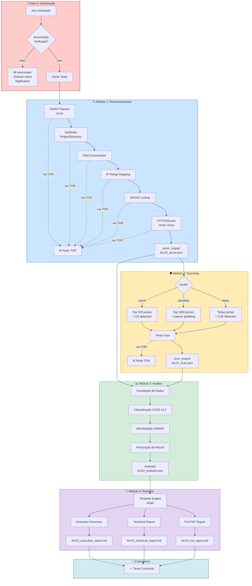

# Workflow da Ethical Red Team Skill

## Diagrama de Fluxo



---

## Fluxo Resumido

| Fase | Módulo | Input | Output |
|------|--------|-------|--------|
| 0 | Autorização | Alvo | Confirmação ✅ |
| 1a | Subdomain Enum | Domínio | `subfinder_output/*.json` (standalone) ou integrado ao recon |
| 1 | Reconhecimento | Domínio/IP | `recon_output/ALVO_recon.json` |
| 2 | Scanning | IP/CIDR | `scan_output/ALVO_scan.json` |
| 3 | Análise | recon + scan | `analysis/ALVO_analysis.json` |
| 4 | Relatório | analysis | `reports/ALVO_*.md/.pdf` |

> **Nota:** Arquivos JSON intermediários usam timestamp: `{prefixo}_YYYYMMDD_HHMMSS.json`
> Gerados pela função `salvar_json()` em `scripts/utils.py`. Aplicam-se a artefatos JSON das fases 1-3 (recon, scan, analysis).

---

## Comandos Correspondentes

### Fase 1a: Enumeração de Subdomínios

```bash
# Como módulo standalone
python scripts/subfinder.py --target alvo.com --output subfinder_output/

# Ou integrado ao recon.py (modo full)
python scripts/recon.py --target alvo.com --mode full --output recon_output/
```

**Requisitos:**
- `subfinder` instalado: `go install -v github.com/projectdiscovery/subfinder/v2/cmd/subfinder@latest`
- Autorização escrita do proprietário

**Validações éticas:**
- Bloqueio automático de TLDs governamentais (`.gov`, `.mil`, `.gov.br`, etc.)
- Log completo para auditoria

### Fase 1: Reconhecimento

```bash
python scripts/recon.py --target alvo.com --mode full --output recon_output/
```

**Modos disponíveis:**
- `passive` — Apenas OSINT (sem contato direto)
- `active` — DNS + IP mapping
- `full` — Passive + Active

### Fase 2: Scanning

```bash
python scripts/scanner.py --target 192.168.1.1 --profile standard --output scan_output/
```

**Perfis disponíveis:**
- `quick` — Top 100 portas + detecção de SO
- `standard` — Top 1000 portas + banner grabbing
- `deep` — Todas portas + CVE detection

### Fase 3: Análise

```bash
python scripts/analyzer.py \
  --recon recon_output/ALVO_recon_*.json \
  --scan scan_output/ALVO_scan_*.json \
  --output analysis/
```

### Fase 4: Relatório

```bash
python scripts/reporter.py \
  --analysis analysis/ALVO_analysis_*.json \
  --target "Nome do Alvo" \
  --tester "Nome do Pentester" \
  --output reports/
```

---

## Requisitos OBRIGATÓRIOS

- ✅ **TOR** deve estar rodando (todas as operações usam TOR)
- ✅ **Autorização escrita** do proprietário do sistema
- ✅ **Escopo definido** (Rules of Engagement)
- ✅ Ambiente virtual Python ativado (`.venv-redteam`)

---

## Estrutura de Diretórios

```
ethical-redteam-skill/
├── scripts/
│   ├── recon.py          # Módulo 1
│   ├── scanner.py        # Módulo 2
│   ├── analyzer.py       # Módulo 3
│   └── reporter.py       # Módulo 4
├── recon_output/         # Saídas do reconhecimento
├── scan_output/          # Saídas do scanning
├── analysis/             # Saídas da análise
├── reports/              # Relatórios finais
└── logs/                 # Logs de execução
```
